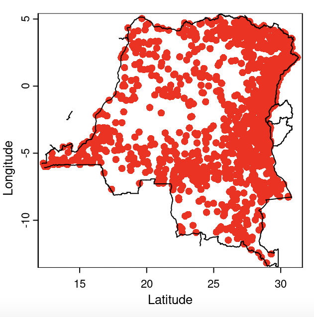
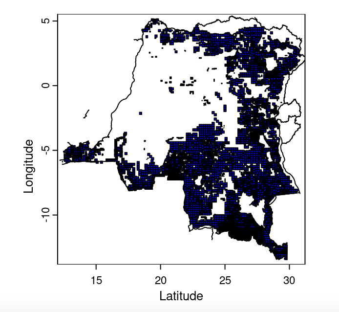
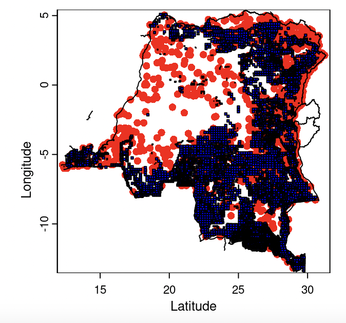
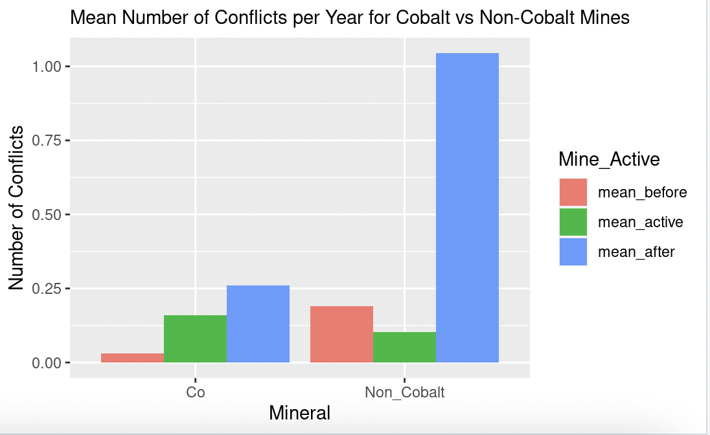

# Team Mining
Luke Morelli, Ashmitha Gowda, Jack Spoleti, Alex Fichter

## Research Question

Does cobalt mining cause more conflict than other forms of mining in the
Democratic Republic of the Congo?


Thousands of Congolese workers cram into a cobalt mining pit (Siddharth
Kara, independent.co.uk).

## Data Wrangling

**Outcome variable**

Our outcome variable is the average number of conflicts that occur
within a 10km radius of each mine per year between 1997 and September
2023. The conflict data is sourced from the Armed Conflict Location &
Event Data Project (ACLED) which contains all of the documented
conflicts, both large and small, in the entire world between 1997 and
2023. The conflict data can be downloaded from this webpage:
https://acleddata.com/data-export-tool/



The map above displays all of the conflicts that occurred in the
Democratic Republic of the Congo between 1997 and September 2023. Each
conflict is represented by a singular red circle on the map.

**Wrangling Methodology**

The following R code contains the instructions for extracting the
spatial data for each conflict from the conflict data provided by the
ACLED.

``` r
library("tidyverse")
library("terra")
library("simplermarkdown")
library("readxl")

#Reads in the data from the spreadsheet produced by the ACLED and filters the data to obtain solely conflicts from the Democratic Republic of the Congo.
Africa_1997_2023_Sep22<-read_excel("Africa_1997-2023_Sep22.xlsx")
acl<-Africa_1997_2023_Sep22 %>%
  filter(COUNTRY=="Democratic Republic of Congo")

#Turns each conflict in the dataset into a spacial vector based on its Longitude and Latitude values.
acl_points<-vect(acl, 
                 geom=c("LONGITUDE", "LATITUDE"), 
                 crs="+proj=longlat +ellps=WGS84 +datum=WGS84 +no_defs ")
plot(acl_points, col = "red", xlab = "Latitude", ylab = "Longitude")
```

**Treatment variable**

Our treatment variable is whether a mine is active or inactive (open or
closed) when a conflict within a 10km radius of that mine occurs. We
decided to split inactive conflicts into two different categories:
conflicts that occurred before the mine opened and conflicts that
occurred after the mine closed. We sourced our data on mining permits
directly from the Democratic Republic of the Congo’s Ministry of Mining
who had made the data publicly available on the Global Forest Watch
website here:
https://data.globalforestwatch.org/datasets/democratic-republic-of-the-congo-mining-permits/explore



The chart above displays all of the mining permits granted in the
Democratic Republic of the Congo between 1997 and September 2023
according to the country’s official data from the Ministry of Mines.
Each mining permit is represented by a singular blue square on the map.

**Wrangling Methodology**

The following R code contains the instructions for reading in the
spatial data for each mining permit as provided by the Democratic
Republic of the Congo’s Ministry of Mines

``` R
```

``` r
library("tidyverse")
library("terra")
library("simplermarkdown")

#Getting data from file provided by the Democratic Republic of the Congo Ministry of Mines
data_name <- "Democratic_Republic_of_the_Congo_mining_permits"

#Creating mines data frame
df_mines_path = paste0(data_name, "/", data_name, ".dbf")
start_date <- as.Date("1997-01-01")
end_date <- as.Date("2023-01-01")
df_mines <- read.dbf(df_mines_path) %>%
  filter(!is.na(date_do)) %>%
  filter(!is.na(date_de1)) %>%
  mutate(days_before = as.numeric(difftime(as.Date(date_do), start_date, units = "days"))) %>%
  mutate(years_before = days_before / 365.25) %>%
  mutate(days_active = as.numeric(difftime(as.Date(date_de1), as.Date(date_do), units = "days"))) %>%
  mutate(years_active = days_active / 365.25) %>%
  mutate(days_after = as.numeric(difftime(end_date, as.Date(date_de1), units = "days"))) %>%
  mutate(years_after = days_after / 365.25)

#Changing name of "objectid" column to "mine_number"
colnames(df_mines)[colnames(df_mines) == "objectid"] <- "mine_number"

#Getting the shapefile which contains the spatial data on where the mining permits are located
data_shp_path <- paste0(data_name, "/", data_name, ".shp")
mines <- vect(data_shp_path)

#Ensuring correct coordinate system
mines_data <- project(mines, "+proj=longlat +ellps=WGS84 +datum=WGS84 +no_defs")
```

**Intersection Process**

Now that we have read in the data for both the conflicts and the mining
permits, we need to determine how many conflicts occurred per year
within a 10km radius of each mine location for each of our three
categories: before mine open, during mine operation, and after mine
close. The following R code demonstrates this process:

``` r
library("tidyverse")
library("terra")
library("simplermarkdown")

#uses the buffer function to create a 10km buffer (radius) around each mine location
mining_center<-centroids(mines_data)
mining_area<-buffer(mining_center, width=10000, capstyle="round")

#initializes a list to store the dataframe of all the conflicts that occured within each mine location's 10km buffer.
intersect_list <- list()

#Looping through all of the mine locations
for(i in 1:nrow(mining_area)) {
  #Gets mine location
  mining_location <- mining_area[i,]
  #Uses the terra package to detirmine all of the conflicts (in acl_points) that occured within the 10km buffer (aka "intersected") with each mine location
  intersections <- terra::relate(mining_location, acl_points, relation = "intersects")
  #Turning the result into a dataframe
  intersections_vec <- as.vector(intersections)
  intersecting_conflicts <- acl[intersections_vec,]
  #Matching each conflict to its corresponding mine location by mine number
  intersecting_conflicts$mine_number <- i
  #adding the dataframe which contains all of the conflicts that intersected with that mining location to the list
  intersect_list[[i]] <- intersecting_conflicts
}
#Turning the final result back into a dataframe
intersect_df <- do.call(rbind, intersect_list_data)

#Merging the final result with the mines dataframe based on mine number in order to determine if conflicts occured before mine open, during mine operation, or after mine close.
merged_df <- merge(intersect_df, df_mines, by = "mine_number", all.x = TRUE, all.y = TRUE) %>%
  mutate(date=as.Date(EVENT_DATE, "%Y-%m-%d")) %>%
  mutate(before = ifelse(date < date_do, 1, 0)) %>%
  mutate(active = ifelse(date > date_do & date < date_de1, 1, 0)) %>%
  mutate(after = ifelse(date > date_de1, 1, 0))

#Creating one last dataframe that contains the following columns for each mine: number of conflicts before mine open, during mine operation, and after mine close, year the mine opened, year the mine closed, mine status (currently open or closed), the type of minerals mined, number of conficts per year for before mine open, during mine operation, and after mine close, and whether the mine is a cobalt mine or not.
final_df <- merged_df %>%
  group_by(mine_number) %>%
  summarize(
    num_conflicts_before = sum(before),
    num_conflicts_active = sum(active),
    num_conflicts_after = sum(after),
    year_start = first(date_do),
    year_end = first(date_de1),
    status = first(statut),
    type = first(resource)) %>%
    mutate(num_conflicts_active = ifelse(is.na(num_conflicts_active), 0, num_conflicts_active)) %>%
  mutate(num_conflicts_before = ifelse(is.na(num_conflicts_before), 0, num_conflicts_before)) %>%
  mutate(num_conflicts_after = ifelse(is.na(num_conflicts_after), 0, num_conflicts_after)) %>%
  mutate(before_conflicts_year = num_conflicts_before/years_before) %>%
  mutate(active_conflicts_year = num_conflicts_active/years_active) %>%
  mutate(after_conflicts_year = num_conflicts_after/years_after) %>%
  mutate(is_cobalt_mine = ifelse(grepl(substring_co, type), 1, 0)) %>%
    filter(!is.na(year_start)) %>%
    filter(!is.na(type))
```



The map above demonstrates the overlap between mining locations and
conflict in the Democratic Republic of the Congo.

**Control variables**

Our control variable is the type of mine, where we are specifically
comparing cobalt mines to all other types of mines. The data on mining
permits provided by the Democratic Republic of the Congo’s Ministry of
Mining contains information on the types of minerals that are mined at
each mining location. A mine is considered a cobalt mine if cobalt is
among the minerals mined at that location

**Wrangling Methodology**

``` r
library("tidyverse")
library("terra")
library("simplermarkdown")

#Given a list of all the possible types of minerals that are present in the mines data, this loop computes the mean number of conflicts for the three categories discussed previously: before mine open, during mine operation, and after mine close for all the mines of each type of mineral.
final_mineral_df <- data.frame()
for(mineral in unique_resources) {
  f2<-final_df %>%
  filter(str_detect(final_df_op$type, mineral)) %>%
  summarize(
    mineral = mineral,
    mean_before = mean(before_conflicts_year),
    mean_active= mean(active_conflicts_year),
    mean_after = mean(after_conflicts_year))
  final_mineral_df <- rbind(final_mineral_df, f2)
}

#filtering the data by mineral type (cobalt or non-cobalt)
cobalt_df <- final_mineral_df %>%
  filter(mineral == "Co")

non_cobalt_df <- final_mineral_df %>%
  filter(mineral != "Co")

#Computes the mean number of conflicts per year for before mine open, during mine operation, and after mine close for all non-cobalt mines
total_non_cobalt_df <- data.frame(mineral = "Non_Cobalt", 
                       mean_active = mean(non_cobalt_df$mean_before),
                       mean_before = mean(non_cobalt_df$mean_active),
                       mean_after = mean(non_cobalt_df$mean_after))

#Combines the two dataframes into one for the following graph
cobalt_comp_df <- rbind(cobalt_df, total_non_cobalt_df)
```

## Preliminary Results



The graph above displays the mean number of conflicts per year for both
cobalt mines and non-cobalt mines within each of the three categories we
previously discussed: before mine open, during mine operation, and after
mine close. Cobalt mines had approximately 64% more active conflicts
(0.160 active conflicts for cobalt mines per year to 0.102 active
conflicts for non-cobalt mines per year on average) while non-cobalt
mines were more likely to have conflicts before they opened (0.190
conflicts before mine open for non-cobalt mines per year to 0.030
conflicts before mine open for cobalt mines per year on average) and
also after they opened (1.04 conflicts after mine close for non-cobalt
mines per year to 0.260 conflicts after mine close for cobalt mines per
year on average). Overall, when taking into account the large
discrepancy in the average amount of conflicts in the years before and
after cobalt and non-cobalt mines were opened, it appears that cobalt
mines did not cause a disproportionate amount of conflict when compared
to other types of mines.

## Regressions

The following three code snippets display Differences-in-Differences
(DiD) regressions that are used to assess the level of causality between
cobalt mines and the mean number of active conflicts.

\(1\)

``` r
read_csv("loadsdatatable.csv") -> df
summary(c1<- lm(n ~ active + re_Co + active:re_Co, data=df))
```

The first regression (pictured above) illustrates a DiD regression in
its most basic format. It computes the impact of cobalt mines on the
mean number of conflicts by including the treatment group (re_Co), the
treatment period (active - which stores whether a mine is active in a
particular year), and their interaction (active:re_Co) as variables in
the DiD model. The results of the regression are statistically
significant and indicate that for every year a cobalt mine is open, it
is predicted to have 0.231 more conflicts on average when compared to
other types of mines.

\(2\)

``` r
summary(c1<- lm(n ~ active + re_Co + active:re_Co + year_do + year_de + year + active_97_22, data=df))
```

The second regression (pictured above) adds control variables to the DiD
model. The control variables are as follows: year_do (date mine opened),
year_de (date mine closed), year, and active_97_22 (number of years a
particular mine is opened between 1997 and 2022). The results of the
regression are still statistically significant, but less drastic than
the previous regression, as they indicate that cobalt mines are
predicted to have 0.164 more conflicts on average when compared to other
types of mines for every year they are open.

\(3\)

``` r
install.packages("lfe")
library("lfe")
modelName <- felm(n ~ active + re_Co + active:re_Co + year_do + year_de + year + active_97_22 + re_Sn + re_Ta | parties + type, data = df)
summary(modelName)
```

Our last regression (pictured above) added fixed effects to the DiD
model, and therefore had to use the felm function instead of the lm
function. The fixed effects are as follows: parties (the mining company
that was granted the permit) and type (the type of mining permit that
was granted). It also added two more control variables (re_Sn and
re_Ta), which represent whether a mine produces tin or tantalum
respectively. The results of the regression are still statistically
significant, but less drastic than the previous two regressions, as they
indicate that cobalt mines are predicted to have 0.148 more conflicts on
average when compared to other types of mines for every year they are
open.
